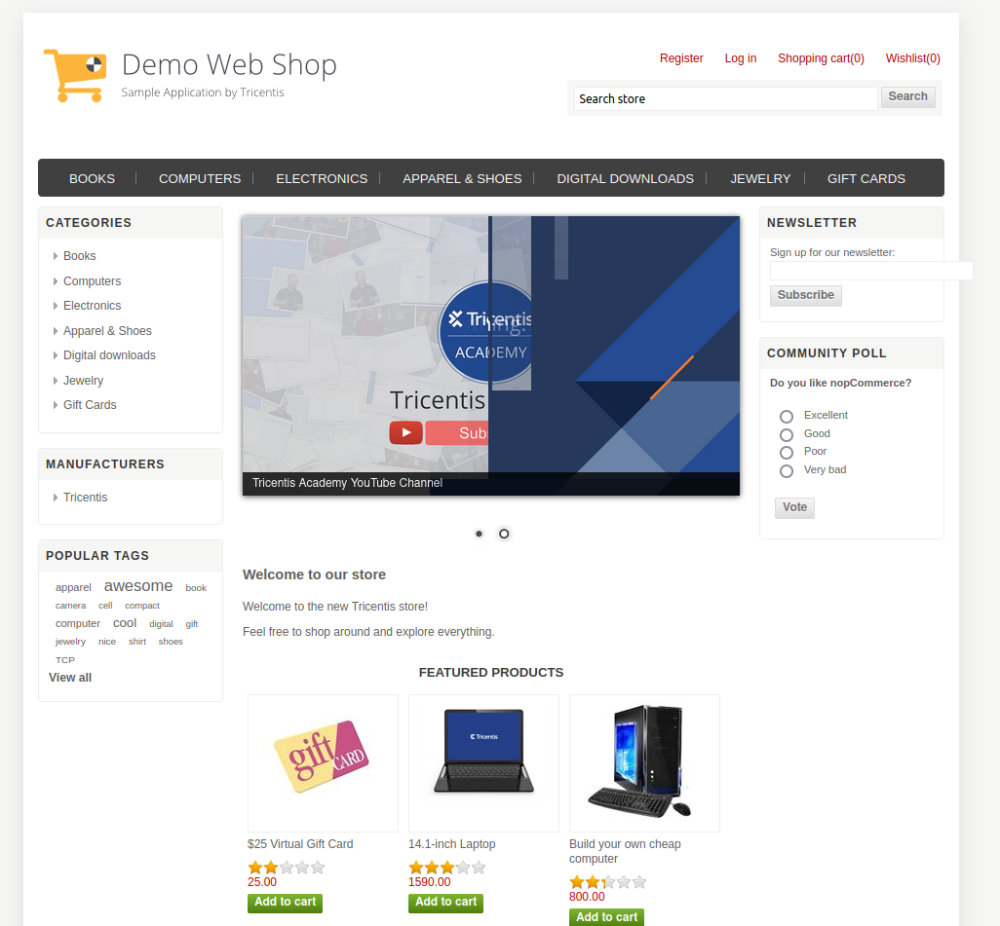

# Проект по автоматизации тестирования API магазина "Demowebshop" и рест-сервиса "Reqres.in"



#### <a target="_blank" href="http://demowebshop.tricentis.com/">Ссылка на сайт магазина</a>
#### <a target="_blank" href="https://reqres.in/">Ссылка на сайт сервиса</a>


## :floppy_disk: Содержание:
- <a href="#computer-технологии-и-инструменты">Технологии и инструменты</a>
- <a href="#notebook_with_decorative_cover-реализованные-проверки">Реализованные проверки</a>
- <a href="#arrow_forward-запуск-из-терминала">Запуск из терминала</a>
- <a href="#electric_plug-сборка-в-Jenkins">Сборка в Jenkins</a>
- <a href="#open_book-allure-отчет">Allure отчет</a>
- <a href="#hammer-allure-test-ops-отчет">Allure Test Ops отчет</a>
- <a href="#robot-отчет-в-telegram">Отчет в Telegram</a>
- <a href="#film_projector-видео-пример-прохождения-тестов">Видео пример прохождения тестов</a>

## :computer: Технологии и инструменты
<p align="center">


</p>

## :notebook_with_decorative_cover: Реализованные проверки
- Проверка авторизации
- Проверка добавления товара в корзину
- Проверка рест запроса на получение списка пользователей
- Проверка рест запроса на получение пользователя
- Негативная проверка рест запроса на получение пользователя
- Проверка рест запроса на создание сущности
- Проверка рест запроса на обновление сущности

## :arrow_forward: Запуск из терминала
Локальный запуск:
```
gradle clean test -Dweb=local
```
Запуск в Browserstack:
```
gradle clean test -Dweb=remote
```

## :electric_plug: Сборка в Jenkins
##### <a target="_blank" href="https://jenkins.autotests.cloud/view/C12-BochkarevAlexej/job/C12-BochkarevAlexej-lesson18/">Сборка в Jenkins</a>
<p align="center">

</p>  

## :open_book: Allure отчет
- ### Стартовая страница отчета
<p align="center">

</p>

- ### Страница с проведенными тестами
<p align="center">

</p>

- ### Страница с диаграммами
<p align="center">

</p>


## :hammer: Allure Test Ops отчет
<p align="center">


</p>

## :robot: Отчет в Telegram
<p align="center">

</p>

## :film_projector: Видео пример прохождения тестов
> К каждому тесту в отчете прилагается видео. Одно из таких видео представлено ниже.
<p align="center">
  
</p>